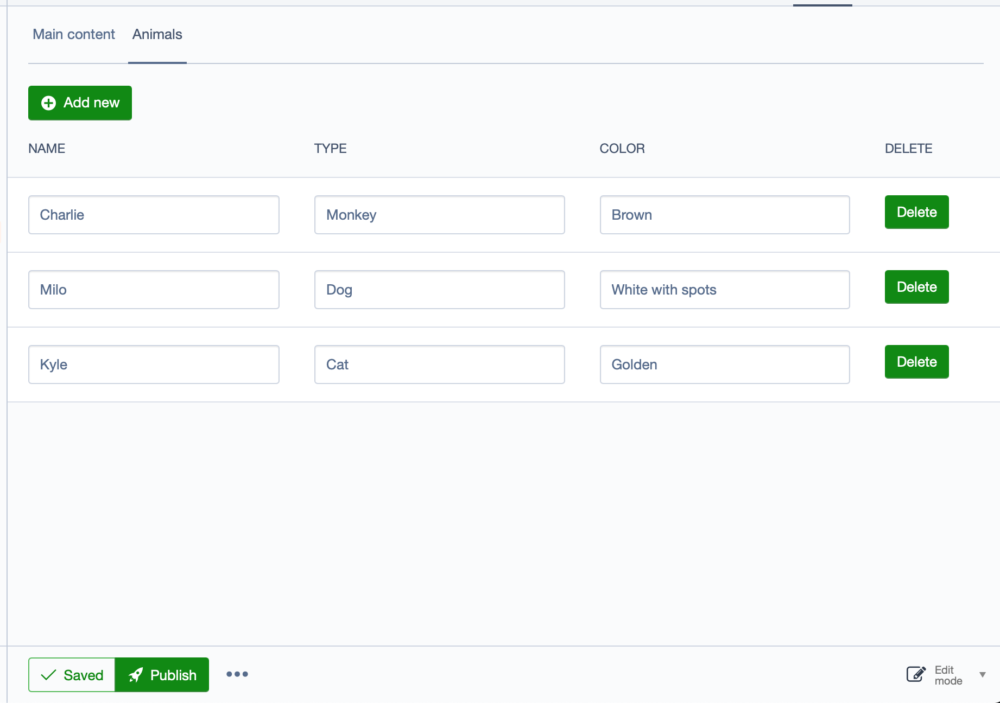

# Data Field
A quick entry field allowing users to enter a lot of data


## Requirements

* SilverStripe ^4.0

## Installation

```
composer require adrhumphreys/datafield dev-master
```

If you have an object with a relation `has_many`/`many_many` then you can use the field.

Say your relation looks like the following:
```
private static $has_many = [
    'Animals' => Animal::class,
];
```

Then you can make a basic field: `DataField::create('Animals');`
If you want to change the relation/class name being used then: `DataField::create('Animals', 'Animals', Animal::class,'Animals');`

You'll then need to configure what fields will be editable on the class like so:
```
class Animal extends DataObject
{
    private static $db = [
        'Name' => 'Varchar',
        'Type' => 'Varchar',
        'Color' => 'Varchar',
    ];

    private static $editable_fields = [
        'Name',
        'Type',
        'Color',
    ];
}
```
